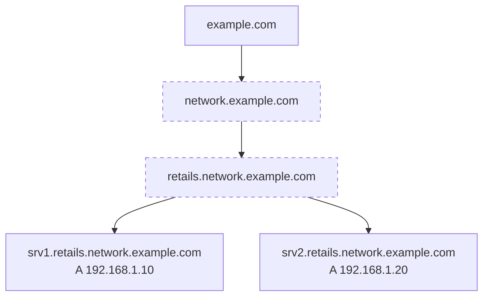
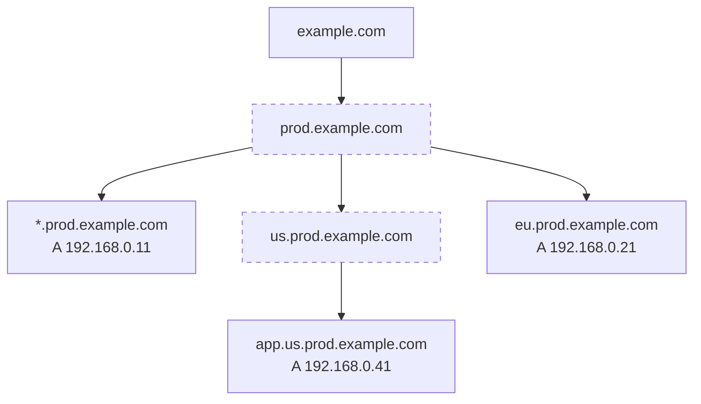
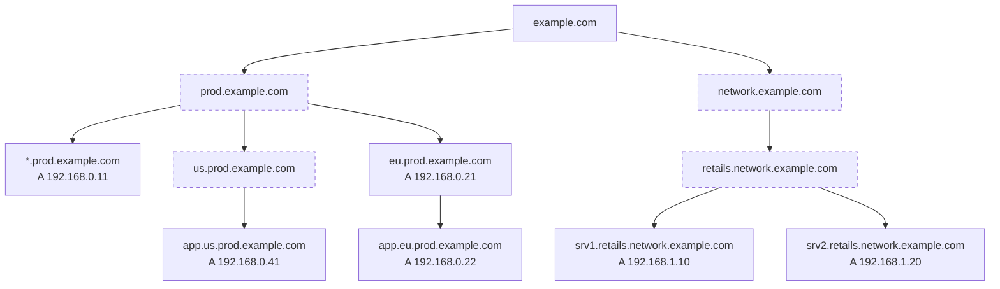
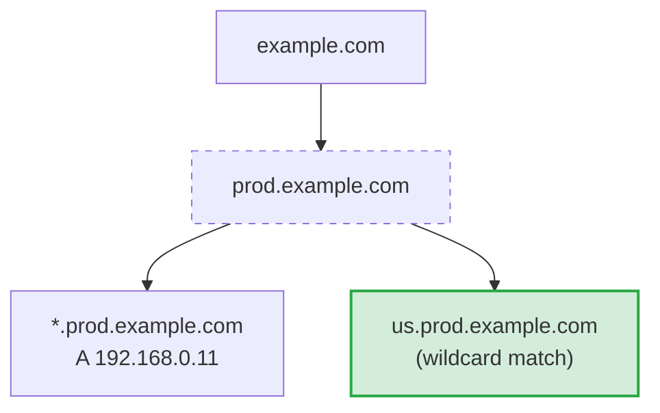
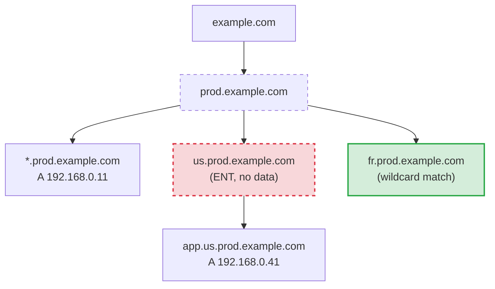

# Empty Non-Terminals

### Table of Contents {#toc}

* TOC
{:toc}

---

## What are Empty Non-Terminals?

In DNS, an **Empty Non-Terminal** (ENT) is an intermediate domain name in a DNS hierarchy that exists only because it is a path to a deeper name, but has no records of its own.

Let's look at a simple example:

```
$ORIGIN example.com.
srv1.retails.network.example.com.  IN  A   192.168.1.10
srv2.retails.network.example.com.  IN  A   192.168.1.20
```

The following diagram shows the hierarchy of names in this zone. Names with dashed borders are Empty Non-Terminals:




In this zone, both `network.example.com` and `retails.network.example.com` are Empty Non-Terminals. They have no records themselves, but exist because of the `srv1` and `srv2` records beneath them.

A typical example is represented by [DKIM records](/articles/dkim-record/) or [Let's Encrypt](/articles/letsencrypt/) certificates, that often generate ENTs due to their specific naming structure (e.g., `selector._domainkey.example.com` creates an ENT at `_domainkey.example.com`).

### ENTs inside wildcard scope

ENTs become more complex when wildcards are involved. If a name exists as an ENT within a wildcard's scope, the wildcard does **not** apply to that name, resulting in an empty response instead of the wildcard value.

```
$ORIGIN example.com.
*.prod.example.com.        IN  A   192.168.0.11
eu.prod.example.com.       IN  A   192.168.0.21
app.us.prod.example.com.   IN  A   192.168.0.41
```




In this zone:

- **`us.prod.example.com`** is an ENT within the wildcard's scope. Queries return empty—the wildcard does **not** apply.
- **`eu.prod.example.com`** has an explicit record, so queries return `192.168.0.21`.
- **`fr.prod.example.com`** (or any non-existent name) matches the wildcard and returns `192.168.0.11`.

For a detailed explanation of how wildcards interact with ENTs, including troubleshooting tips, see [Wildcards and Empty Non-Terminals](#wildcards-and-empty-non-terminals) below.

### ENTs outside wildcard scope

ENTs are not limited to wildcard scenarios. Any record with a multi-level subdomain creates ENTs along its path. Let's expand the zone further:

```
$ORIGIN example.com.
*.prod.example.com.                IN  A   192.168.0.11
eu.prod.example.com.               IN  A   192.168.0.21
app.eu.prod.example.com.           IN  A   192.168.0.22
app.us.prod.example.com.           IN  A   192.168.0.41
srv1.retails.network.example.com.  IN  A   192.168.1.10
srv2.retails.network.example.com.  IN  A   192.168.1.20
```

The diagram below illustrates the zone tree:




In this zone:

- **`network.example.com`** and **`retails.network.example.com`** are ENTs created entirely outside the wildcard's scope. They exist only because `srv1.retails.network.example.com` and `srv2.retails.network.example.com` are beneath them.

- **`eu.prod.example.com`** is **not** an ENT, even though it has a child record (`app.eu.prod.example.com`). Because it has its own explicit A record, queries to `eu.prod.example.com` return `192.168.0.21`.

- **`us.prod.example.com`** remains an ENT—it has no record of its own, only a child record.

**Query results:**

```
$ dig @ns1.dnsimple.com network.example.com A +short
(empty - ENT, no records returned)

$ dig @ns1.dnsimple.com retails.network.example.com A +short
(empty - ENT, no records returned)

$ dig @ns1.dnsimple.com srv1.retails.network.example.com A +short
192.168.1.10

$ dig @ns1.dnsimple.com eu.prod.example.com A +short
192.168.0.21

$ dig @ns1.dnsimple.com app.eu.prod.example.com A +short
192.168.0.22
```

This example demonstrates that ENTs can appear anywhere in your zone hierarchy—not just beneath wildcards. Any time you create a deeply nested record, intermediate names become ENTs unless they have their own explicit records.

## How ENTs respond to DNS queries

According to [RFC 4592 Section 2.2.1](https://datatracker.ietf.org/doc/html/rfc4592#section-2.2.1), when you query an ENT, the authoritative name server must return:

- **Status:** `NOERROR` (the name exists)
- **Answer section:** Empty (no records at this name)

This is known as a `NODATA` response. It indicates that the domain name exists but has no records of the requested type. This behavior is straightforward for zones without wildcards—you simply get no data. However, as we'll see below, ENTs can cause unexpected results when wildcards are involved.

<note>
As of December 2025, DNSimple name servers comply with RFC 4592 for Empty Non-Terminal handling.
</note>

**Querying an ENT:**

Using our zone example, let's query the ENT `network.example.com`:

```
$ dig @ns1.dnsimple.com network.example.com A

; <<>> DiG 9.10.6 <<>> @ns1.dnsimple.com network.example.com A
;; global options: +cmd
;; Got answer:
;; ->>HEADER<<- opcode: QUERY, status: NOERROR, id: 12345
;; flags: qr aa rd; QUERY: 1, ANSWER: 0, AUTHORITY: 1, ADDITIONAL: 0

;; QUESTION SECTION:
;network.example.com.       IN  A

;; AUTHORITY SECTION:
example.com.        3600    IN  SOA ns1.dnsimple.com. admin.dnsimple.com. ...

;; Query time: 45 msec
;; SERVER: 198.241.10.53#53(198.241.10.53)
```

Notice the key indicators:

- **`status: NOERROR`** — The name exists in the zone
- **`ANSWER: 0`** — No records are returned in the answer section
- The **SOA record** in the authority section confirms this is a valid `NODATA` response

This is the expected behavior: `network.example.com` exists as an ENT (because of the records beneath it), so it returns no data. There's no wildcard involved, so the result is intuitive.

## Wildcards and Empty Non-Terminals

Wildcards and ENTs have a complex relationship that can lead to unexpected behavior. Understanding how they interact is critical for maintaining predictable DNS resolution.

According to RFC 4592, a wildcard record (e.g., `*.example.com`) matches query names that:

1. Are within the wildcard's scope (subdomains of `example.com`)
2. **Do not exist** in the zone

**This second condition is key: if a name exists, even as an Empty Non-Terminal, the wildcard does **not** apply.**

A common scenario occurs when adding a record deeper in the hierarchy inadvertently creates an ENT that blocks wildcard matching. Consider this zone:

```
$ORIGIN example.com.
*.prod.example.com.   IN  A   192.168.0.11
```




With only this wildcard record, querying `us.prod.example.com` returns:

```
$ dig @ns1.dnsimple.com us.prod.example.com A +short
192.168.0.11
```

The wildcard matches because `us.prod.example.com` does not exist in the zone.

Now, let's add a record deeper in the hierarchy:

```
$ORIGIN example.com.
*.prod.example.com.        IN  A   192.168.0.11
app.us.prod.example.com.   IN  A   192.168.0.41
```




In this diagram:

- **Green background**: `fr.prod.example.com` — Does not exist, so the wildcard applies and returns `192.168.0.11`
- **Red background**: `us.prod.example.com` — Now exists as an ENT (because of `app.us.prod.example.com`), so the wildcard does **not** apply and returns empty

Let's compare the queries.

**Querying `fr.prod.example.com` (non-existent name, wildcard matches):**

```
$ dig @ns1.dnsimple.com fr.prod.example.com A +short
192.168.0.11
```

The wildcard `*.prod.example.com` matches because `fr.prod.example.com` does not exist in the zone.

**Querying `us.prod.example.com` (ENT, wildcard blocked):**

```
$ dig @ns1.dnsimple.com us.prod.example.com A

; <<>> DiG 9.10.6 <<>> @ns1.dnsimple.com us.prod.example.com A
;; global options: +cmd
;; Got answer:
;; ->>HEADER<<- opcode: QUERY, status: NOERROR, id: 54321
;; flags: qr aa rd; QUERY: 1, ANSWER: 0, AUTHORITY: 1, ADDITIONAL: 0

;; QUESTION SECTION:
;us.prod.example.com.       IN  A

;; AUTHORITY SECTION:
example.com.        3600    IN  SOA ns1.dnsimple.com. admin.dnsimple.com. ...

;; Query time: 42 msec
;; SERVER: 198.241.10.53#53(198.241.10.53)
```

Even though `us.prod.example.com` falls within the wildcard's scope, it returns empty. According to RFC 4592, the wildcard at `*.prod.example.com` does **not** apply here because the name `us.prod.example.com` now exists (as an ENT). Wildcards only match names that do not exist, not ENTs.

<warning>
Different DNS providers may implement ENTs, especially wildcard support, differently. While RFC 4592 mandates returning an empty response for ENTs, some providers may (intentionally or unintentionally) return the wildcard match instead.

This may lead to unexpected behaviors, especially when:
- Transitioning a zone between providers
- Implementing secondary DNS

In particular, with Secondary DNS (like via AXFR), you must ensure both providers adopt the same ENT implementation to avoid inconsistent responses.

DNSimple complies with RFC 4592 and follows industry-standard behaviors consistent with implementations like PowerDNS.
</warning>

## Common scenarios that create ENTs

Be aware of these common patterns that can create ENTs:

- **ACME/Let's Encrypt challenges:** `_acme-challenge.subdomain.example.com`
- **DKIM records:** `selector._domainkey.example.com` creates an ENT at `_domainkey.example.com`
- **SRV records:** `_service._tcp.example.com` creates ENTs at `_tcp.example.com`
- **Deeply nested subdomains:** Any record like `a.b.c.example.com` creates ENTs at `b.c.example.com` and `c.example.com`

### The ACME challenge example

Let's say you provision a [Let's Encrypt](/articles/letsencrypt/) certificate for `app.us.prod.example.com`. The ACME challenge process automatically adds a TXT record:

```
$ORIGIN example.com.
*.prod.example.com.                      IN  A    1.2.3.4
_acme-challenge.app.us.prod.example.com. IN  TXT  "validation-token-here"
```

This single TXT record creates **multiple Empty Non-Terminals** in the path:

- `app.us.prod.example.com` — ENT
- `us.prod.example.com` — ENT

Now, querying `us.prod.example.com` returns an empty response:

```
$ dig @ns1.dnsimple.com us.prod.example.com A +short
(empty)
```

The wildcard no longer matches because `us.prod.example.com` now exists as an ENT.

**Before the ACME challenge record:**

```
$ dig @ns1.dnsimple.com us.prod.example.com A +short
1.2.3.4

$ dig @ns1.dnsimple.com app.us.prod.example.com A +short
1.2.3.4

$ dig @ns1.dnsimple.com anything.prod.example.com A +short
1.2.3.4
```

All names match the wildcard because none of them exist.

**After the ACME challenge record:**

```
$ dig @ns1.dnsimple.com us.prod.example.com A +short
(empty - now an ENT)

$ dig @ns1.dnsimple.com app.us.prod.example.com A +short
(empty - now an ENT)

$ dig @ns1.dnsimple.com anything.prod.example.com A +short
1.2.3.4
```

The presence of the ACME challenge record created ENTs along its path, blocking wildcard matching for those names.

## Next steps

Now that you understand what Empty Non-Terminals are and how they work:

- **[How to Fix Empty Responses from Empty Non-Terminals](/articles/how-to-fix-empty-responses-from-empty-non-terminals/)** — Step-by-step guide to resolving ENT-related issues in your DNS zone

- **[Troubleshooting Empty Non-Terminal Issues](/articles/troubleshooting-empty-non-terminal-issues/)** — Diagnose and resolve intermittent or unexpected empty responses caused by ENTs

## Have more questions?

If you have additional questions or need any assistance with Empty Non-Terminals, just [contact support](https://dnsimple.com/feedback), and we'll be happy to help.
